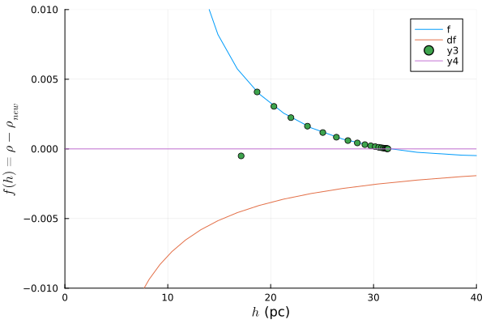

# Galaxy
The aim of this project is to construct a simple hydrodynamical simulation in julia. 

# Theory

I chose to use smoothed particle hydrodynamics (SPH) which is based on the lagrangian
particle formulation. I calculate forces in the frame of the particle, using lagrangian
derivatives, i.e.

$$\alpha + \int_0^1~$$

***

